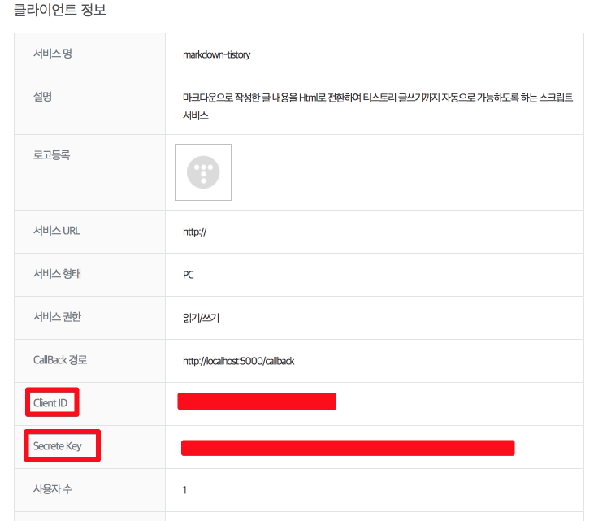
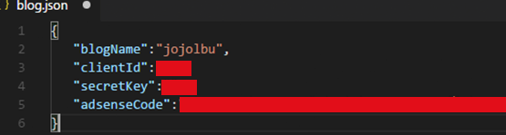
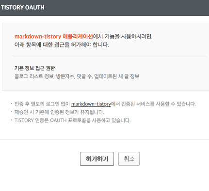
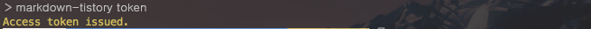
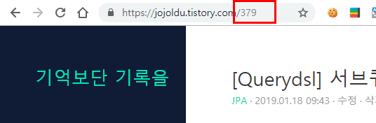

# md-tistory

[](https://github.com/jojoldu/md-tistory/actions/workflows/qodana.yml)
[](https://github.com/jojoldu/md-tistory/actions/workflows/ci.yml)

PC에 작성된 마크다운 파일을 티스토리 OAuth API를 통해 HTML, 이미지로 변환하여 포스팅해주는 스크립트


## 1. Install

현재 nodejs **20.9.0** 버전에서 개발되어있기에 20.x 버전 이상을 사용하길 권장드립니다.

기존의 npm 패키지 설치와 동일하게 아래와 같은 커맨드로 설치가 가능합니다.

```bash
npm install -g md-tistory
```

## 2. Usage

기본적으로 OAuth 키가 발급 되어야 사용 가능합니다.  
**가장 먼저 키 발급**을 해주세요

### 2-1. 키 발급

먼저 [티스토리 API](https://www.tistory.com/guide/api/manage/register)로 이동하여 임시 클라이언트를 등록합니다.

(주의 : 서비스 URL 과 callback 경로에는 꼭  http://localhost:5050/callback 으로 적어주세요.)

등록 후 발급되는 client id와 secret key를 사용할 예정이니 메모장에 복사하시고



명령 프롬프트(윈도우), 터미널(맥/리눅스)을 열어 ```md-tistory init 에디터``` 명령어를 입력하여, 값을 등록합니다.

아래중 하나의 에디터는 설치되어 있어야 합니다.

* sublime
    * Sublime Text
* atom
    * Atom Editor
* code
    * Visual Studio Code
* vim
* emacs

PC에 설치된 에디터의 종류에 따라 입력하시면 됩니다.

예제)

```bash
md-tistory init code
```

오픈 된 파일에는 다음과 같은 값을 등록하시면 됩니다.
(스크린샷은 Visual Studio Code 에디터 입니다.)



* blogName : 본인의 블로그 주소 (ex: jojoldu.tistory.com의 jojoldu를 입력하시면 됩니다.)
* clientId : API에 등록한 client id
* secretKey : API에 등록한 secret key
* adsenseCode : 구글광고 코드

해당 파일 저장후, AccessToken을 발급 받겠습니다.  
아래의 명령어를 입력합니다.

```bash
md-tistory token
```

브라우저가 열려 다음과 같이 OAuth2 인증이 등장합니다.



허가하기를 클릭하시면 터미널에 다음과 같이 성공 메세지가 출력됩니다.



이제 인증키는 모두 발급 받았습니다.

> 티스토리 AccessToken은 **1개월의 유효기간**을 갖고 있습니다.  
한달이 지나서 키가 만료되었다는 메세지가 보이면 다시 키를 발급(```md-tistory token```) 받으시면 됩니다.


### 2-2. 글 등록

마크다운 파일 **위치를 지정하면** 지정된 위치의 해당 파일을,  
**위치를 지정하지 않으면 현재 위치**에서 해당 파일을 찾아 포스팅합니다.

1. 현재 위치의 마크다운 파일

```bash
md-tistory -w
```

2. 절대주소로 마크다운 파일 지정

```bash
md-tistory -w /Users/woowahan/Documents/git/md-tistory/README.md
```

3. 현재 터미널 위치의 상대주소로 마크다운 파일 지정

```bash
md-tistory -w ./README.md
```

**비공개**로 포스팅 되니, 본인 블로그의 관리자 페이지로 이동하여 게시글을 공개로 전환하시면 됩니다.

### 2-3. 등록된 글 수정

글 수정은 **포스팅 ID**가 꼭 필요합니다.



(여기서 379가 포스팅Id입니다.)


```bash
md-tistory -u 파일위치 포스팅ID
```

만약 파일위치를 입력하지 않으시면, **현재 위치의 마크다운 파일**이 선택됩니다.

```bash
md-tistory -u 포스팅ID
```

### 2-4. 블로그 정보 수정

이미 만들어진 blog.json 정보를 수정하고 싶다면 아래의 명령어를 사용하시면 됩니다.

('blog.json' 은 유저 홈 디렉토리에 생성이 됩니다.)

```
md-tistory show 에디터
```

생성된 blog.json이 지정한 에디터에 오픈됩니다.

## 3. 주의사항

* 티스토리에서 5MB 이상의 이미지는 허용하지 않습니다.
    * 400에러가 발생하며 업로드가 안되니 웬만하면 5MB 이하로 맞춰주세요.
* 문장의 **첫 글자에 코드 문법이 있으면 파싱 에러**가 발생합니다.
    * 띄어쓰기 한번을 해주세요

* ```sudo```를 통해 명령어를 실행하면 이후 에디터에서 저장이 안됩니다
    * ```init```, ```token```등 에디터를 통해 수정하는 기능들은 ```sudo``` 없이 실행해주세요

* 게시글의 제목은 **마크다운 파일명**을 기준으로 합니다.

* mac에서 토큰 발급 시 `시스템 환경설정 > 공유 > AirPlay 수신 모드 해제` 후 진행해주세요.
